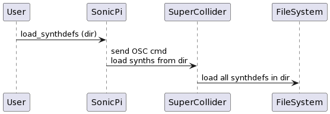

<!-- DO NOT EDIT - this file generated by the literate code reader -->
<!-- https://gordonguthrie.github.io/literatecodereader/ -->
# Chapter 3 - Deep dive

## How `load_synthdefs` works

There are two commands that load user-defined synthdefs [load_synthdef](https://github.com/sonic-pi-net/sonic-pi/blob/dev/app/server/ruby/lib/sonicpi/lang/sound.rb#L3307) and [load-synthdefs](https://github.com/sonic-pi-net/sonic-pi/blob/dev/app/server/ruby/lib/sonicpi/lang/sound.rb#L3357).

Both of these functions load synthdefs the same way that the boot sequence does - they call the same function `load_synthdefs` in [server.rb](https://github.com/sonic-pi-net/sonic-pi/blob/dev/app/server/ruby/lib/sonicpi/server.rb#L155) which sends an OSC message to SuperCollider telling it to load the synthdefs.

The sequence is:

