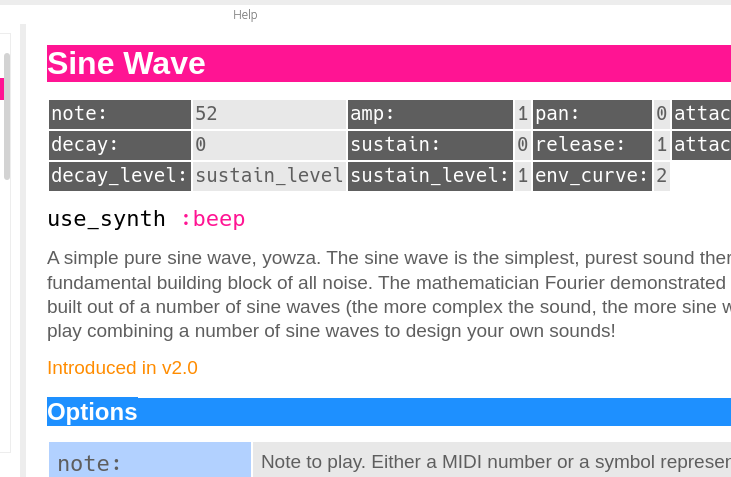

<!-- DO NOT EDIT - this file generated by the literate code reader -->
<!-- https://gordonguthrie.github.io/literatecodereader/ -->
# Chapter 4 - How built-in synths are defined in Sonic Pi

## Philosophy

One of the working philosophies of Sonic Pi is that the tech shouldn't get in the way of experimentation.

All the built-in synths share common parameters - some have additional parameters. The idea is that if you have some running code (or are live coding) and you swap out one synth for another then bad things SHOULDN'T happen - it should behave much as you expected and not in a surprising way.

This section is going to look at [synthinfo.rb](https://github.com/sonic-pi-net/sonic-pi/blob/710107fe22c5977b9fa5e83b71e30f847610e240/app/server/ruby/lib/sonicpi/synths/synthinfo.rb).

## BaseInfo

All synthesiser objects inherit from the base class `BaseInfo` mostly by the chain of indirection: `SonicPiSynth < SynthInfo < BaseInfo`.

But looking at all the synthesiser classes we see a simple pattern - synths come in families and often descend from a common base class.

Note that sometimes synth names are just aliases for each other `sine`/`beep` and `mod_sine`/`mod_beep`. This aliasing happens in the global variable [@@synth_info](https://github.com/sonic-pi-net/sonic-pi/blob/710107fe22c5977b9fa5e83b71e30f847610e240/app/server/ruby/lib/sonicpi/synths/synthinfo.rb#L8118).

To be recognised as a synth you need to be added to the global variable `@@synth_infos` in `synthinfo.rb`.

We can tell what functions are designed to be implemented in the sub-classes by looking for base class members that will blow up if they are not. Examining the [code](https://github.com/sonic-pi-net/sonic-pi/blob/710107fe22c5977b9fa5e83b71e30f847610e240/app/server/ruby/lib/sonicpi/synths/synthinfo.rb#L81) we see:

```ruby
      def doc
        "Please write documentation!"
      end

      def arg_defaults
        raise "please implement arg_defaults for #{self.class}"
      end

      def name
        raise "please implement name for synth info: #{self.class}"
      end

      def category
        raise "please implement category for synth info: #{self.class}"
      end

      def prefix
        ""
      end

      def synth_name
        raise "Please implement synth_name for #{self.class}"
      end

      def introduced
        raise "please implement introduced version for synth info: #{self.class}"
      end

      def trigger_with_logical_clock?
        raise "please implement trigger_with_logical_clock? for synth info: #{self.class}"
      end
```

There is an extra function `specific_arg_info` which isn't in this list and by default which returns empty hashes.

Let's go through them one by one.

### function doc

This function is called when the displaying the GUI. If we go to [the `doc` function for the `beeb` synth](https://github.com/sonic-pi-net/sonic-pi/blob/710107fe22c5977b9fa5e83b71e30f847610e240/app/server/ruby/lib/sonicpi/synths/synthinfo.rb#L805) and edit it to add the word ***yowza***:

```ruby
      def doc
        "A simple pure sine wave, yowza. The sine wave is the simplest, purest sound there is and is the fundamental building block of all noise. The mathematician Fourier demonstrated that any sound could be built out of a number of sine waves (the more complex the sound, the more sine waves needed). Have a play combining a number of sine waves to design your own sounds!"
      end
```

This function is called during the compile process (not at run time) and is used to generate the entry about the synth in the GUI.



### function arg_defaults

Here is the `arg_defaults` function of the `beep` synthesizer:

```ruby
       {
          :note => 52,
          :note_slide => 0,
          :note_slide_shape => 1,
          :note_slide_curve => 0,
          :amp => 1,
          :amp_slide => 0,
          :amp_slide_shape => 1,
          :amp_slide_curve => 0,
          :pan => 0,
          :pan_slide => 0,
          :pan_slide_shape => 1,
          :pan_slide_curve => 0,

          :attack => 0,
          :decay => 0,
          :sustain => 0,
          :release => 1,
          :attack_level => 1,
          :decay_level => :sustain_level,
          :sustain_level => 1,
          :env_curve => 2
        }
      end
```

It is simply the list of all the arguments and their default values - note how the values are chained - the default value of `:decay_level` is defined as `:sustain_level`. (The chaining is only 1 level deep - you can chain a variable to the value of another one, but that one needs an actual value.)

Oftentimes this function is shared between multiple synths by use of an intermediate class. See later on where the following functions inherit their arguments from the `Noise` synth:

* BNoise
* ChipNoise
* CNoise
* GNoise
* PNoise

If you are writing a family of synths you should consider this strategy.

The ***values*** here show one side of the story - but the function [`default_arg_info`](https://github.com/sonic-pi-net/sonic-pi/blob/710107fe22c5977b9fa5e83b71e30f847610e240/app/server/ruby/lib/sonicpi/synths/synthinfo.rb#L329) contains another:

```ruby
      def default_arg_info
        {
          :note =>
          {
            :doc => "Note to play. Either a MIDI number or a symbol representing a note. For example: `30`, `52`, `:C`, `:C2`, `:Eb4`, or `:Ds3`",
            :validations => [v_positive(:note)],
            :modulatable => true
          },

          :note_slide =>
          {
            :doc => "Amount of time (in beats) for the note to change. A long slide value means that the note takes a long time to slide from the previous note to the new note. A slide of 0 means that the note instantly changes to the new note.",
            :validations => [v_positive(:note_slide)],
            :modulatable => true,
            :bpm_scale => true
          },
          ...

```

This function contains a big set of standard, well-named common parameters. Different synthesisers support different subsets (and different families like the detuned ones or the mod ones or the pulse ones) support similar sets of parameters.

* `note`
* `note_slide`
* `note_slide_shape`
* `note_slide_curve`
* `amp`
* `amp_slide`
* `pan`
* `pan_slide`
* `attack`
* `decay`
* `sustain`
* `release`
* `attack_level`
* `decay_level`
* `sustain_level`
* `env_curve`
* `cuttoff`
* `cuttoff_slide`
* `detune`
* `detune_slide`
* `mod_phase`
* `mod_phase_offset`
* `mod_phase_slide`
* `mod_range`
* `mod_range_slide`
* `res`
* `res_slide`
* `pulse_width`
* `pulse_width_slide`
* `mod_pulse_width`
* `mod_pulse_width_slide`
* `mod_wave`
* `mod_invert_wave`

Using these parameters (where appropriate) with these names and the default validations in them will determine if your synthesiser ***feels like*** a well behaved Sonic Pi synthesiser.

To understand that better you will need to study the synthesiser definitions in Sonic Pi and figure out which synth uses which parameter and then dig in and see how it is defined in the synthdefs.

Some, of course, will be in `Overtone` and you will have to reverse engineer the underlying `SuperCollider` form.

### function name

This is the name of the synth as it appears in the GUI - the name you use in code is defined in the function `synth_name`.

### functions category and prefix

Both of these are preset for you during the [class inheritance chain](https://github.com/sonic-pi-net/sonic-pi/blob/710107fe22c5977b9fa5e83b71e30f847610e240/app/server/ruby/lib/sonicpi/synths/synthinfo.rb#L589): `MySynth > SynthInfo > BaseInfo`

```ruby
    class SynthInfo < BaseInfo
      def category
        :general
      end

      def prefix
        "sonic-pi-"
      end
    end
```

Remember that Sonic Pi uses SuperCollider to:

* define and play synths
* define and wire up FX
* play samples

This code base is used to support all three - but the dip into `SynthInfo` makes a synth a synth and your class invoked wherever synths are in play.

### function synth_name

This is the name of the synth as used in Sonic Pi code - all lowercase and spaces replaced with `_`s.

These names are also aliased in the definition of [``@@synth_infos``](https://github.com/sonic-pi-net/sonic-pi/blob/710107fe22c5977b9fa5e83b71e30f847610e240/app/server/ruby/lib/sonicpi/synths/synthinfo.rb#L8118)

### function trigger_with_logical_clock

This function is used by FXs and not synths - so don't worry about it.

### function specific_arg_info

The function `specific_arg_info` lets you do validation on arguments that you have added to your synth that aren't part of the set that was discussed in the section `arg_defaults` - they take the same format.

In addition synths commonly add the functions `arg_defaults` and `specific_arg_info`.

| Synth name        | Base Class        | arg_defaults | specific_arg_info |
|-------------------|-------------------|--------------|-------------------|
| Bass Foundation   | SonicPiSynth      | Yes          |                   |
| Bass Highend      | SonicPiSynth      | Yes          | Yes               |
| Beep/SynthViolin  | SonicPiSynth      | Yes          |                   |
| Blade             | SonicPiSynth      | Yes          | Yes               |
| Bnoise            | Noise             |              |                   |
| Chipbass          | SonicPiSynth      | Yes          | Yes               |
| Chiplead          | SonicPiSynth      | Yes          | Yes               |
| Chipnoise         | Noise             | Yes          | Yes               |
| Cnoise            | Noise             |              |                   |
| Dark Ambience     | SonicPiSynth      | Yes          | Yes               |
| Dpulse            | Dsaw              | Yes          | Yes               |
| Dsaw              | SonicPiSynth      | Yes          |                   |
| Dtri              | Dsaw              |              |                   |
| Dull Bell         | SonicPiSynth      | Yes          |                   |
| Fm                | SonicPiSynth      | Yes          | Yes               |
| Gnoise            | Noise             |              |                   |
| Growl             | SonicPiSynth      | Yes          |                   |
| Hollow            | SonicPiSynth      | Yes          | Yes               |
| Hoover            | SonicPiSynth      | Yes          |                   |
| (Synth) Kalimba   | SonicPiSynth      | Yes          | Yes               |
| Mod Beep          | alias for ModSine | Yes          |                   |
| Mod Dsaw          | SonicPiSynth      | Yes          |                   |
| Mod Fm            | FM                | Yes          |                   |
| Mod Pulse         | SonicPiSynth      | Yes          |                   |
| Mod Saw           | SonicPiSynth      | Yes          |                   |
| Mod Sine          | SonicPiSynth      | Yes          |                   |
| Mod Tri           | SonicPiSynth      | Yes          |                   |
| Noise             | Pitchless         | Yes          |                   |
| Organ Tonewheel   | SonicPiSynth      | Yes          | Yes               |
| (Synth) Piano     | SonicPiSynth      | Yes          | Yes               |
| (Synth) Pluck     | SonicPiSynth      | Yes          | Yes               |
| Pnoise            | Noise             |              |                   |
| Pretty Bell       | DullBell          |              |                   |
| Prophet           | SonicPiSynth      | Yes          |                   |
| Pulse             | Square            | Yes          |                   |
| (Synth) Rodeo     | SonicPiSynth      | Yes          | Yes               |
| Saw               | Beep              | Yes          |                   |
| Sine              | alias for Beep    | Yes          |                   |
| Square            | SonicPiSynth      | Yes          |                   |
| Subpulse          | Pulse             | Yes          | Yes               |
| Supersaw          | SonicPiSynth      | Yes          |                   |
| Tb303             | SonicPiSynth      | Yes          | Yes               |
| Tech Saws         | SonicPiSynth      | Yes          |                   |
| Tri               | Pulse             |              |                   |
| Winwood Lead      | SonicPiSynth      | Yes          | Yes               |
| Zawa              | SonicPiSynth      | Yes          | Yes               |

The base class broadly defines a well-behaved Sonic Pi synth, particularly in the function [default_arg_info](https://github.com/sonic-pi-net/sonic-pi/blob/710107fe22c5977b9fa5e83b71e30f847610e240/app/server/ruby/lib/sonicpi/synths/synthinfo.rb#L329) which defines a complete set of arguments most built-in synthesisers accept.

