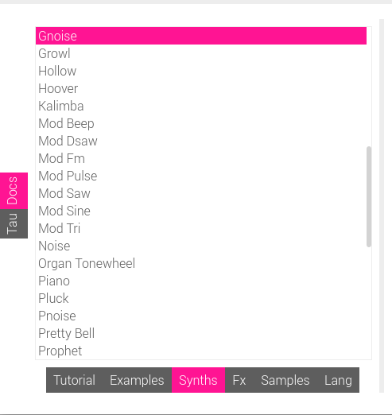

<!-- DO NOT EDIT - this file generated by the literate code reader -->
<!-- https://gordonguthrie.github.io/literatecodereader/ -->
# Chapter 5 - Recreating the bep synth

## Where's my synth?

If you have just restarted Sonic Pi after editing the Ruby and you look at the synth page our new synth isn't there:

